# Отчет по лабораторной работе

**Студент:** Алиев Рауф
**Группа:** 8.2

## 📋 Описание проекта

В рамках лабораторной работы был развернут воспроизводимый контейнерный стенд интернет-магазина (Microshop Platform) с микросервисной архитектурой. Проект запускается одной командой и представляет собой единую систему, состоящую из прикладных и инфраструктурных сервисов.

* [Практическое задание №2](#практическое-задание-2)
* [Практическое задание №3](#практическое-задание-3)
* [Практическое задание №4 - Helm, CRD & RBAC](#практическое-задание-4---helm-crd--rbac)---
---
## 📁 Структура репозитория (Deliverables)

* `auth-service-go/Dockerfile` — сервис авторизации.
* `backend-java/Dockerfile` — основное API.
* `order-worker-python/Dockerfile` — воркер обработки очереди.
* `frontend-react/Dockerfile` — UI часть (с настроенным `nginx.conf` для SPA routing).
* `nginx-gateway/nginx.conf` — конфигурация шлюза и reverse-proxy.
* `docker-compose.yml` — конфигурация сборки и запуска всего стека (14 контейнеров).
* `.env.example` — пример файла с переменными окружения.
* `init.sql` — скрипт инициализации схемы БД и первичных данных.
* `minio-seed.sh` — bash-скрипт для автоматического создания бакета и загрузки изображений в MinIO при старте.

---
## Лог исправлений и работы приложения

- [x] **1. Запуск стенда:** Проект запускается одной командой `docker compose up --build`. Конфигурация управляется через `.env`.
- 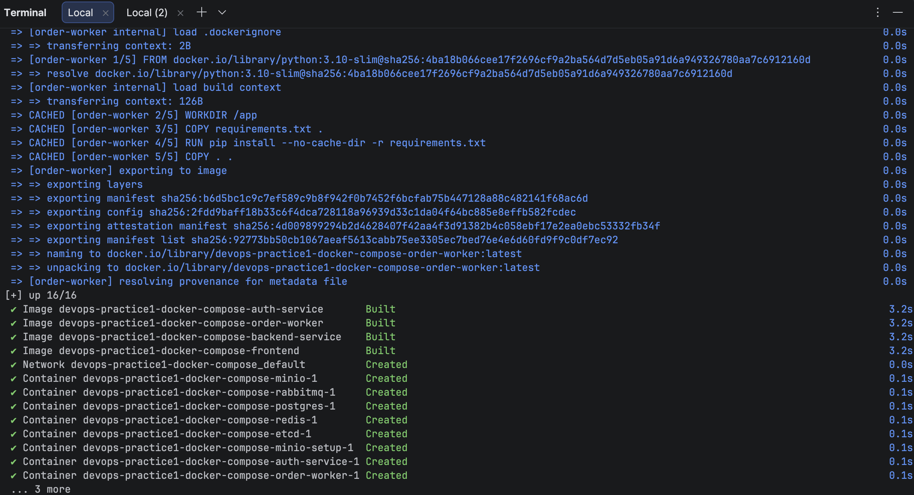

- [x] **2. Статус контейнеров:** Вывод `docker compose ps` — все ключевые сервисы в статусе `Up`.
  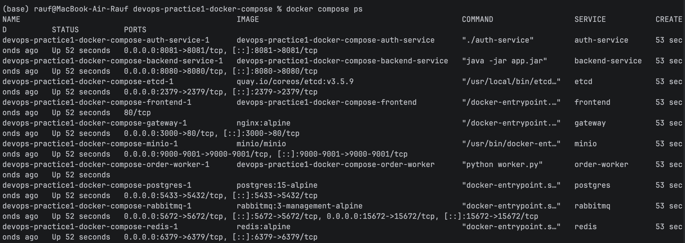
- [x] **3. Единая точка входа:** Шлюз (Nginx) работает. Открывается `http://localhost:3000`, главная страница рендерится без ошибок.
  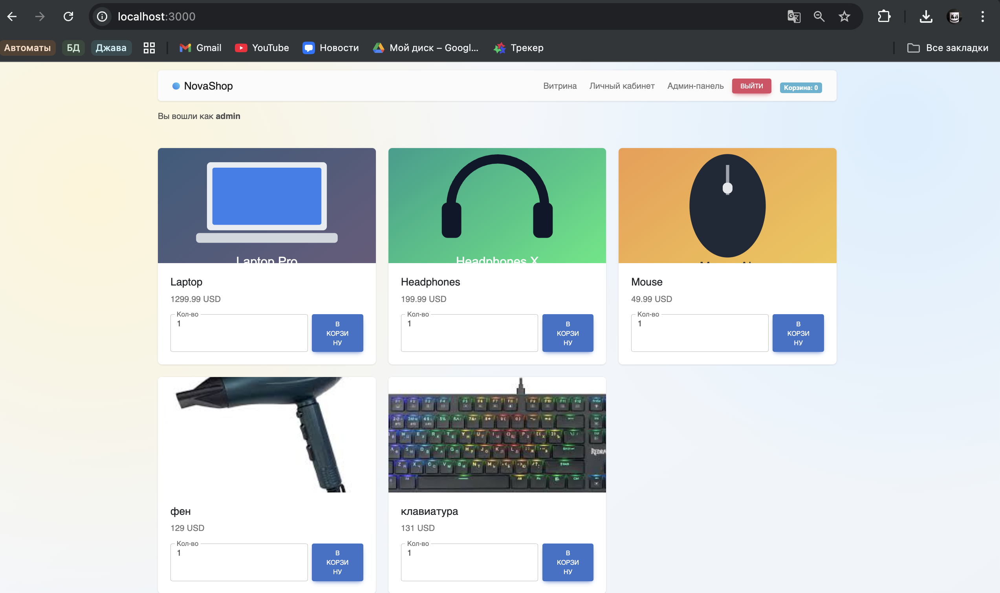
- [x] **4. Витрина и API:** Витрина показывает минимум 3 товара с картинками. `GET /api/products` через gateway возвращает 200 и JSON массив.
  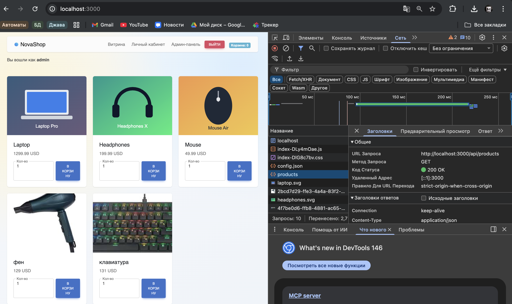
- 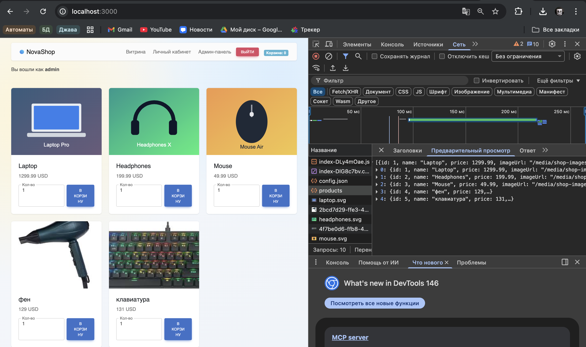
- [x] **5. Регистрация и Логин:** `POST /api/auth/register` создает пользователя (201). `POST /api/auth/login` возвращает токен сессии (200). Сессии сохраняются в Redis, пользователи в etcd.
  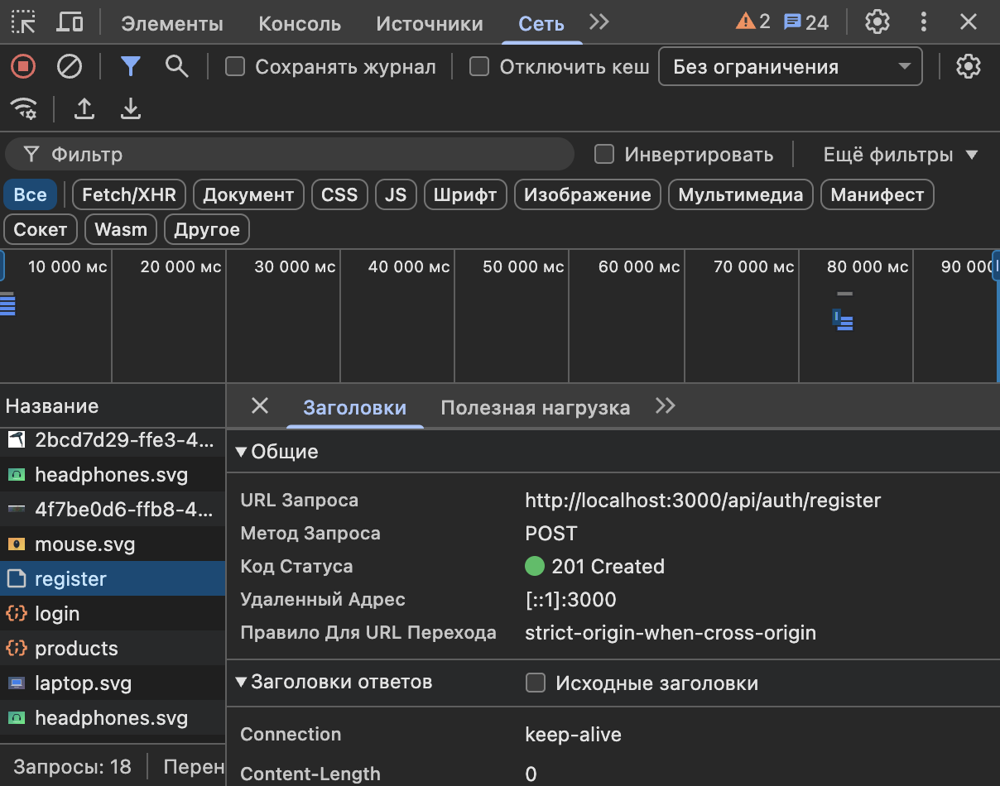
- [x] **6. Доступность изображений:** Изображения товаров загружаются из бакета MinIO и доступны по URL `/media/...` (ответ 200).
  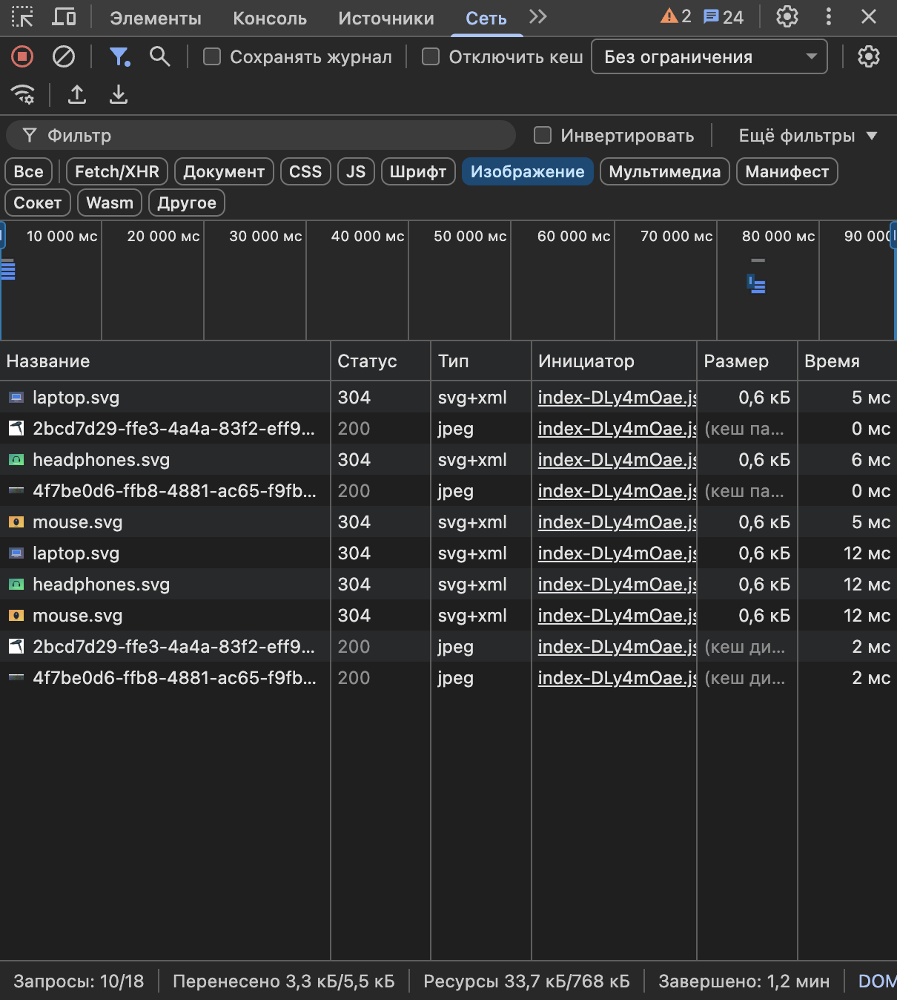
- [x] **7. Оформление заказа:** Оформление доступно после логина. `POST /api/orders/checkout` с токеном возвращает 201. Заказ отображается через `GET /api/orders/my` в кабинете.
- 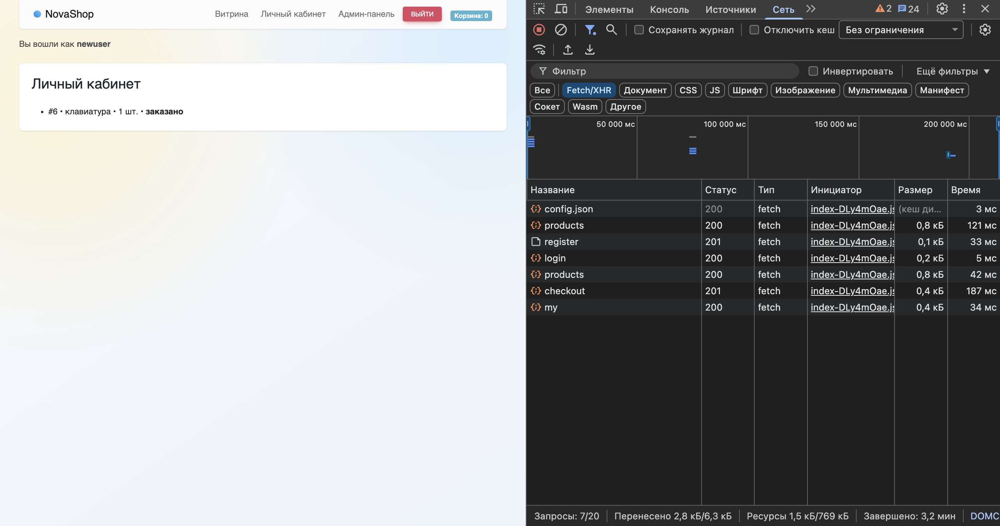

- [x] **8. Асинхронная обработка (RabbitMQ + Python Worker):** Через короткое время статус заказа в кабинете автоматически меняется на: _"Заказ доставлен в магазин по адресу Университетская площадь, д.1."_
  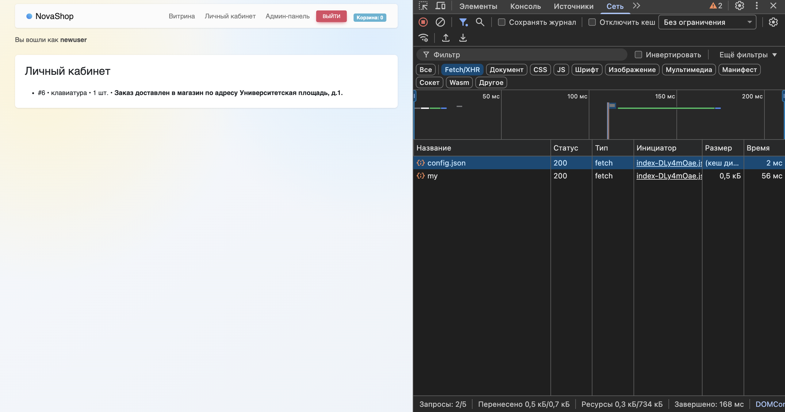
- [x] **9. Панель администратора (Добавление товара):** Вход под `admin` работает. Создание товара через форму с загрузкой изображения проходит успешно.
  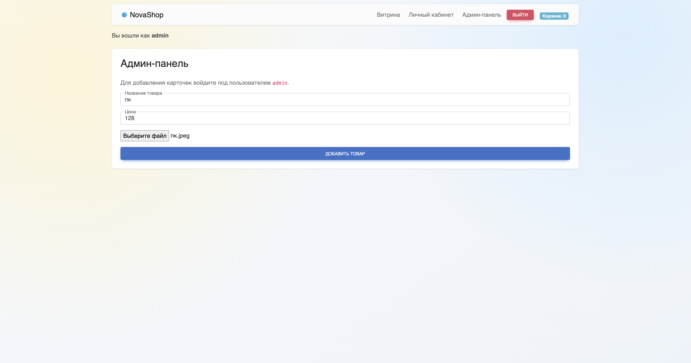
- [x] **10. Обновление витрины:** Добавленный админом товар автоматически (без ручного изменения кода) отображается на главной странице.
  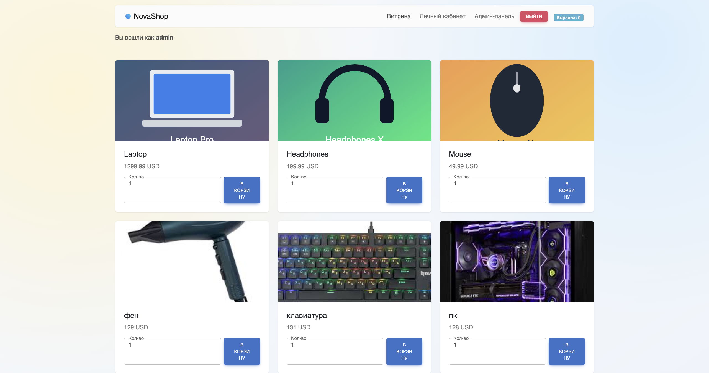
- [x] **11. Сохранность данных (Volumes):** При перезапуске контейнеров (`docker compose down` -> `up -d`) данные PostgreSQL (заказы, товары) и MinIO (загруженные картинки) не теряются.
  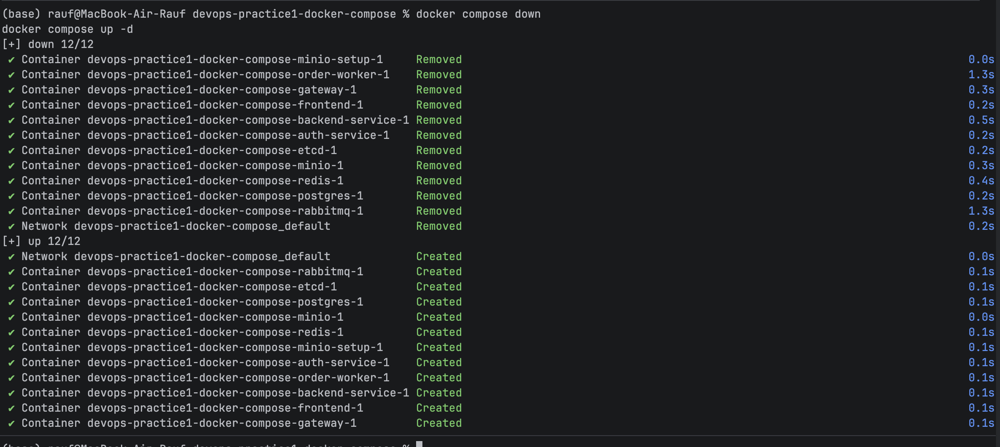
- 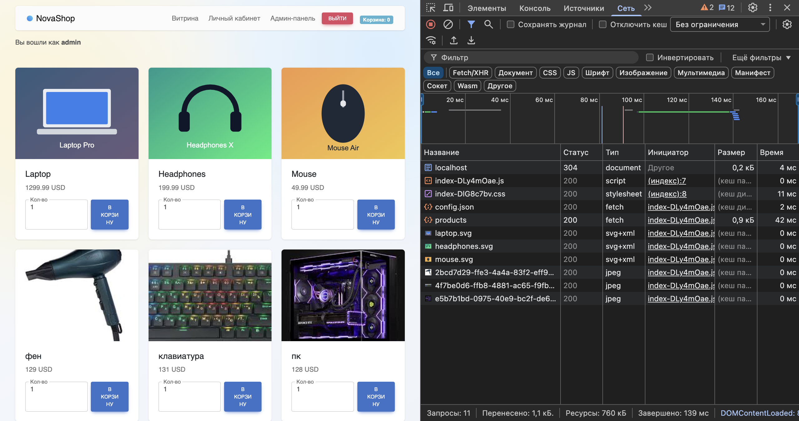
## 🔧 Особенности реализации и решенные проблемы

- **SPA Routing:** В `nginx.conf` фронтенда добавлена директива `try_files $uri $uri/ /index.html;`, что решает проблему 404 ошибки при прямом переходе или обновлении страницы (`F5`) на маршрутах вроде `/cabinet`.

- **Авто-инициализация MinIO:** Настроен дополнительный ephemeral-контейнер `minio-setup`, который дожидается старта хранилища, автоматически создает бакет, прогружает seed-изображения и выдает политику `download` (Public Read) для корректной отдачи картинок фронтенду.

- **Настройка Worker-а:** Сконфигурированы переменные окружения для Python-воркера для правильного подключения к очереди `orders.queue` в RabbitMQ с учетными данными по умолчанию.

По факту работа оказалось не трудной и очень интересной во многом чисто мои ошибки и не правильно выбранный подход, простые команды логирования в докере для разных сервисов решает сразу тысячу проблем, были решены некоторые ловушки который изначально были поставлены по типу не той передачи логина и пароля проблема решения добавления картинок отображения переназначении корзины на запись и чтение, добавление способа при нажатии обновлении обновлялось, а не вылетало с ошибкой, дальше изменение с Обработано на Университетскую площадь, и еще я sql и .sh к докер файлу перекинул и он начал корректно в бд все добавлять, я все менял чисто по докер файлам и все будет корректно подниматься. И еще какие-то вещи, которые не сильно помню. По факту гуглить надо только как докер файлики правильно оформлять и только сами логи по ошибкам и все в целом.
docker compose logs -f gateway
docker compose logs -f backend-service
docker compose logs -f postgres
docker compose logs -f minio
docker compose logs minio-setup
docker compose logs -f order-worker

## Практическое задание №2
Была прописана и использована следующая архитектура
📁 kubik_practice/
├── 📁 app/                           
│    ├── 📄 Dockerfile                
│    ├── 📄 pom.xml
│    └── 📁 src/
│         ├── 📁 main/
│         │    ├── 📁 java/com/rest/backend/k8s_app/
│         │    │    ├── 📄 K8sAppApplication.java     
│         │    │    └── 📁 controller/
│         │    │         └── 📄 HelloController.java   
│         │    └── 📁 resources/
│         │         └── 📄 application.properties
│         └── 📁 test/java/com/rest/backend/k8s_app/
│              └── 📄 K8sAppApplicationTests.java
│
└── 📁 manifests/                     
├── 📄 1-configmap.yaml
├── 📄 2-deployment.yaml
├── 📄 3-service.yaml
└── 📄 4-getaway.yaml


Дальше через start.spring.io был создан pom.xml. Написан Dockerfile, и манифесты Deployment, ConfigMap, Service, Ingress.
Собран Докерфайл по шаблону docker build -t skip1987/k8s-app:v1 .
Дальше через Minikube minikube start
minikube addons enable ingress
kubectl apply -f manifests/
И проброшен туннель для подключения minikube tunnel
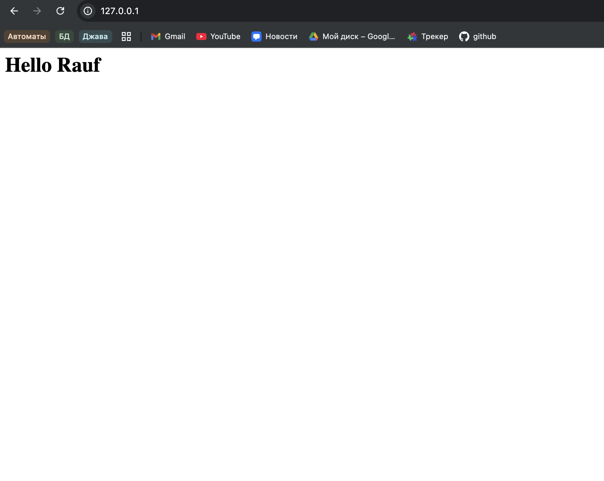

# Практическое задание №3
Были дописаны новые джава классы
-Visit
-VisitRepository
Прописаны две новые зависимости в pom.xml
Добавлен блок env  с прописанными данным БД в 2-deployment.yaml
Добавлен gateway.yaml  Gateway(classname eg) и HTTPRoute
Добавлен postgres.yaml прописаны настройки бд порт и объем памяти
Смысл в том чтобы на виртуальной машине МиниКубика должна быть выделенная часть памяти, которая никогда не будет стираться и на которой будет храниться бд.
Были прописаны 3 версии в ДокерХабе

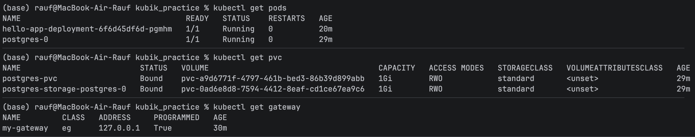
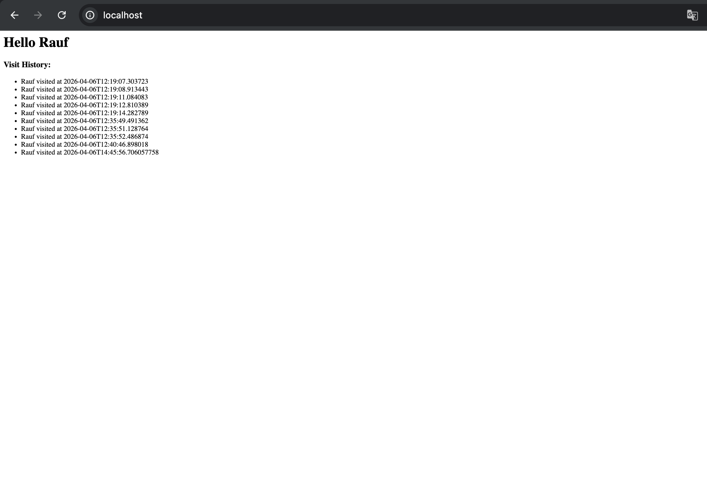

# Использованные Команды
kubectl apply -f https://github.com/kubernetes-sigs/gateway-api/releases/download/v1.0.0/standard-install.yaml
kubectl get pods
kubectl logs deploy/hello-app-deployment
kubectl apply -f manifests/2-deployment.yaml
kubectl delete ingress hello-app-ingress
ingress.networking.k8s.io "hello-app-ingress" deleted from default namespace
kubectl apply --server-side -f https://github.com/envoyproxy/gateway/releases/download/v1.0.0/install.yaml
kubectl get gateway
kubectl get svc -A | grep envoy
kubectl get pods -n envoy-gateway-system
kubectl describe gateway my-gateway
kubectl get pvc
kubectl apply -f
- <<
  -EOF
  apiVersion: gateway.networking.k8s.io/v1
  kind: GatewayClass
  metadata:
  name: eg
  spec:
  controllerName: gateway.envoyproxy.io/gatewayclass-controller
  EOF
  gatewayclass.gateway.networking.k8s.io/eg created

  

## Практическое задание №4 - Helm, CRD & RBAC

### 📁 Структура Helm-чарта (novashop)
Вся инфраструктура теперь разворачивается одной командой `helm upgrade --install novashop ./shop-chart`.
```text

shop-chart/
├── Chart.yaml             # Описание чарта
├── values.yaml            # Общие переменные (версии, порты)
├── infra/                 # Скрипты инициализации БД и картинок
└── templates/
    ├── auth-go.yaml       # Микросервис авторизации (Go)
    ├── backend-java.yaml  # Основное API (Java Spring)
    ├── frontend-react.yaml# UI (React)
    ├── worker-python.yaml # Воркер очередей (Python)
    ├── postgres.yaml      # CRD для CloudNativePG (БД)
    ├── init-db-configmap.yaml # Инициализация таблиц БД
    ├── rabbitmq.yaml      # Брокер сообщений
    ├── minio.yaml         # S3 Хранилище
    ├── etcd.yaml          # K-V хранилище для Go-сервиса
    ├── gateway.yaml       # Настройки Gateway API и HTTPRoute
    └── cert-issuer.yaml   # CRD для CertManager (самоподписанные сертификаты)

```
1.Перевод манифестов на Helm и запуск:
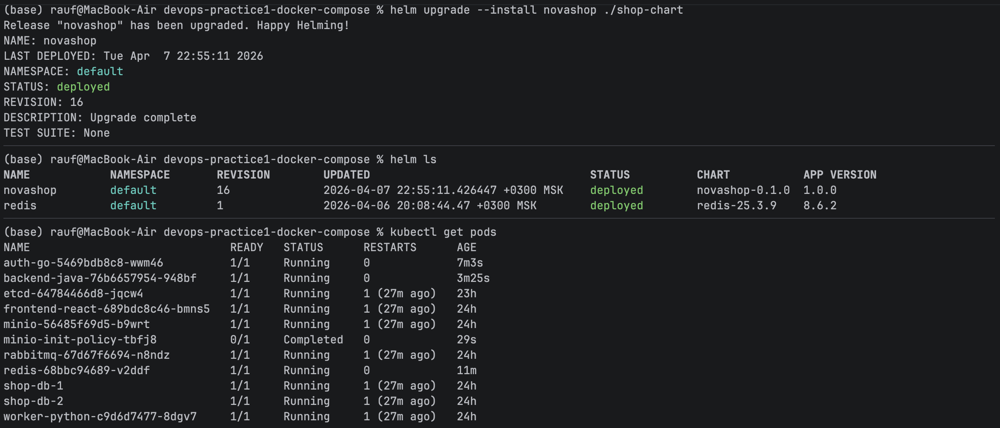
2.Использование CloudNativePG оператора:
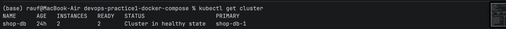
3.Gateway API и CertManager (HTTPS):
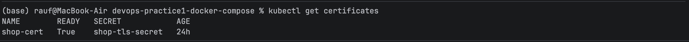
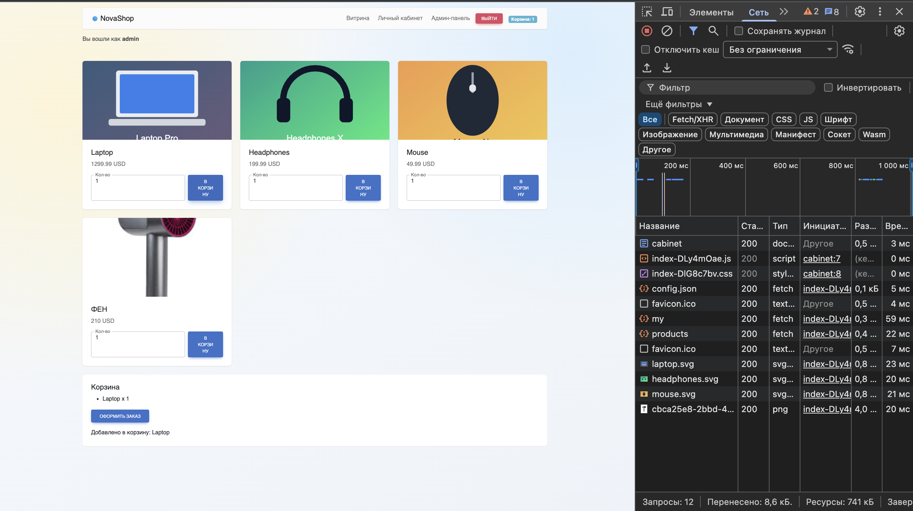


1. **Проблема с образами Bitnami (RabbitMQ/MinIO):** * **Проблема:** При попытке использовать чарты/образы Bitnami с тегом `latest` кластер выдавал ошибку `manifest unknown` и `ImagePullBackOff`.

    - **Решение:** Отказ от нестабильных сторонних чартов. В наш собственный Helm-чарт были написаны легковесные манифесты с использованием официальных стабильных образов (`rabbitmq:3-management` и `minio/minio:latest`).

2. **Конфликт прав владельца таблиц PostgreSQL (`must be owner`):**

    - **Проблема:** При развертывании через CloudNativePG, init-скрипты выполнялись от имени суперпользователя, а Java-бэкенд подключался как `shop_user` и падал при попытке изменить структуру (`ALTER TABLE`).

    - **Решение:** Из Java-кода была полностью убрана логика миграций. В SQL-скрипт инициализации добавлены права: `ALTER TABLE ... OWNER TO shop_user;`. Для чистого применения был принудительно удален старый PVC базы данных (`kubectl delete pvc --all`).

3. **Маршрутизация и права доступа к MinIO (Картинки не грузились):**

    - **Проблема:** Фронтенд запрашивал картинки по пути `/media/shop-images/...`. Gateway отправлял это на React, который возвращал HTML (статус 200), из-за чего иконки были "битыми". Позже сам MinIO выдавал `403 Access Denied`. Кроме того, в образе MinIO отсутствовал архиватор `tar`, из-за чего не работала команда `kubectl cp`.

    - **Решение:** * В Gateway API добавлен фильтр `URLRewrite`, который на лету отрезал `/media` и отправлял запрос напрямую в под MinIO.

        - Написан bash-скрипт (через `kubectl exec -i minio-seeder -- mc pipe`), который передавал файлы в бакет напрямую через поток, обходя отсутствие `tar`.

        - Использована команда `mc anonymous set download`, чтобы сделать бакет публичным на чтение.

4. **Ошибка 404 и 503 при регистрации (Маршрутизация к Go-сервису):**

    - **Проблема:** Gateway перехватывал запросы `/api/auth/register` и отправлял их в Java, которая выдавала 404. После направления в Go-сервис, он снова выдавал 404, а затем 503.

    - **Решение:** * В `gateway.yaml` настроена строгая иерархия (сначала точный `/api/auth`, затем общий `/api`).

        - Применен `ReplacePrefixMatch` для отсечения `/api` перед передачей в Go.

        - Выявлено отсутствие базы данных `etcd`, необходимой для Go-сервиса. Был добавлен новый манифест `etcd.yaml`, после чего регистрация прошла успешно.
# Использованные команды
В процессе отладки и деплоя активно использовались следующие команды:

**Управление Helm:**

- `helm upgrade --install novashop ./shop-chart` — установка/обновление релиза

- `helm uninstall novashop` — удаление релиза

- `helm ls` — просмотр установленных релизов


**Управление и дебаг Kubernetes (kubectl):**

- `kubectl get pods` — статус всех подов

- `kubectl get svc` — статус сервисов

- `kubectl get cluster` — статус кластеров CloudNativePG

- `kubectl get certificates` — проверка выдачи сертификатов (CertManager)

- `kubectl get gateway,httproute` — проверка правил маршрутизации

- `kubectl describe pod <pod-name>` — детальная информация (поиск причин `ImagePullBackOff`)

- `kubectl logs -l app=backend-java --tail=50` — чтение логов по меткам

- `kubectl rollout restart deployment <name>` — мягкий перезапуск деплоймента

- `kubectl delete pvc --all` — удаление всех дисков (сброс состояния баз данных)

- `kubectl patch pvc <name> -p '{"metadata":{"finalizers":null}}'` — принудительное удаление зависших PVC


**Работа с MinIO внутри кластера:**

- `minikube tunnel` — проброс портов сервисов типа LoadBalancer (Gateway) на хост

- `kubectl port-forward svc/minio 9001:9001` — прямой проброс порта для доступа к админке MinIO

- `kubectl run minio-seeder --image=minio/mc --restart=Never -- sleep 300` — запуск временного пода-утилиты

- `cat file.svg | kubectl exec -i minio-seeder -- mc pipe myminio/shop-images/...` — передача файла напрямую в S3 хранилище через пайпы (обход отсутствия утилиты tar).


